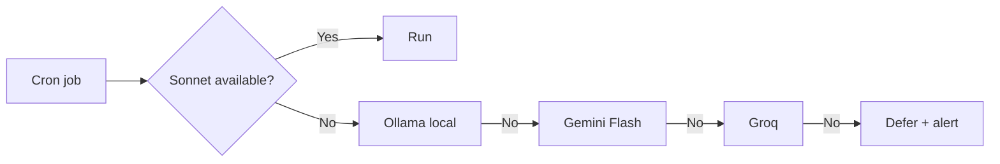

# clawd

> ⚠️ Before using, replace all placeholder values (YOUR_SERVER_IP, your-domain.com, YOUR_TIMEZONE, etc.) with your actual configuration.

Extensions for [OpenClaw](https://github.com/openclaw/openclaw) built while running a personal AI agent daily. Four modules: persistent memory, reliable cron jobs, proactive notifications, and cost control.

## What's inside

### `memory/`

4-layer memory system on top of OpenClaw's default file-based storage.

- **LanceDB** — vector database for fast semantic search. Before each response, the agent searches for relevant facts instead of reading files. Patched to support Russian tokenization (not included by default — only Czech and English).
- **RAG** — 71k chunks indexed. Agent retrieves relevant context before generating responses.
- **DAG** — directed acyclic graph with 45k entities and 85k relations. Captures not just facts, but *why* decisions were made and what alternatives existed.
- **Prompt injections** — persistent context injected each session to prevent drift in long conversations.

```bash
# Build/update vector index
python3 scripts/memory/build_vector_index.py --update

# Search across memory
python3 scripts/memory/unified_search.py "your query"
```

### `skills/cron-model-fallback/`

OpenClaw has fallback chains for chat agents — but not for cron events. When the primary model hits its daily limit, scheduled tasks fail silently. `fallback.py` fixes this.

Chain: `Sonnet → Ollama (local) → Gemini Flash → Groq`

```bash
# Wrap any cron task
python3 skills/cron-model-fallback/fallback.py "your task prompt here"
```



### `soul/`

Proactive agent notifications without constant LLM calls. Principle: Python first, LLM last.

Three files:
- **`soul_collect.py`** — runs hourly via cron. No LLM. Collects signals: open threads, weather, new registrations, server status.
- **`soul_decide.py`** — filters signals through rules. Quiet hours: 10:00–16:00 YOUR_TIMEZONE (work time), 03:00–10:00 (night). Thresholds: not every event is worth a notification.
- **`soul_notify.py`** — called only when a signal passes all filters. Invokes LLM to compose a short summary and sends to Telegram.

```bash
# Run manually
bash soul/soul_runner.sh

# Or add to cron
0 * * * * /path/to/soul/soul_runner.sh
```

Cost: ~$0.002/day vs ~$0.08/day when using LLM for all checks.

### `scripts/`

Supporting scripts:

| Script | What it does |
|--------|-------------|
| `scripts/memory/build_vector_index.py` | Build/update LanceDB index from workspace files |
| `scripts/memory/unified_search.py` | Combined vector + entity graph search |
| `scripts/memory/search_history.sh` | Full-text search across conversation history |
| `scripts/care_loop/care_scan_v2.py` | Workspace health monitoring (14 monitors, 7 categories) |
| `scripts/budget/track.py` | Token usage tracking by day/agent |
| `scripts/logging/analyze_logs.py` | Agent activity analysis |

## Architecture principle

If a task can be described as a flowchart — don't use LLM. Use Python.

LLM is for: reasoning, generating, understanding context.
Python is for: checking availability, fetching data, comparing numbers, filtering by time.

This cut daily token spend by ~50%.

## Requirements

- Python 3.10+
- OpenClaw installed and configured
- LanceDB: `pip install lancedb`
- For Soul Daemon: Telegram bot token in environment

Key imports across modules:
```
lancedb, sentence-transformers, networkx, requests, python-dotenv
```

## Related

- Blog: http://looi.ru
- Telegram channel: @cronbun at telegramm

## License

MIT
